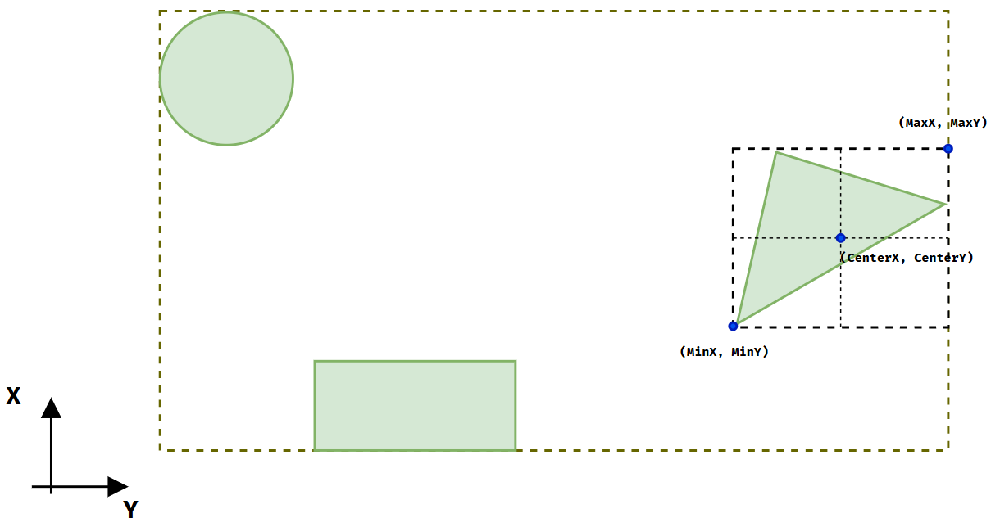

# Primitive Alignment Example Project


[](LICENSE)
[](README.en-US.md)
[](README.md)

## Interface Definition

```csharp
public interface IAlignable
{
    /// <summary>
    /// Gets the axis-aligned bounding box (AABB) in world coordinates
    /// </summary>
    Box GetWorldBoundingBox();

    /// <summary>
    /// Gets the world transformation matrix
    /// </summary>
    Transform GetWorldTransform();

    /// <summary>
    /// Sets the world transformation matrix
    /// </summary>
    void SetWorldTransform(Transform transform);
}
```

## Bounding Box Calculation



## Alignment Algorithm

1. Retrieve world bounding boxes for all primitives
2. Calculate union of all bounding boxes to get combined bounds
3. Compute alignment positions based on combined bounds properties (MinX, MinY, MaxX, MaxY, CenterX, CenterY)

```csharp
private static (float dx, float dy) CalculateOffset(Box box, AlignType type, Box referenceBox)
{
    return type switch
    {
        AlignType.Left => (referenceBox.MinX - box.MinX, 0),
        AlignType.HCenter => (referenceBox.CenterX - box.CenterX, 0),
        AlignType.Right => (referenceBox.MaxX - box.MaxX, 0),
        AlignType.Top => (0, referenceBox.MaxY - box.MaxY),
        AlignType.VCenter => (0, referenceBox.CenterY - box.CenterY),
        AlignType.Bottom => (0, referenceBox.MinY - box.MinY),
        _ => throw new ArgumentException("Invalid alignment type", nameof(type)),
    };
}
```
